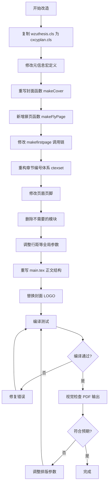
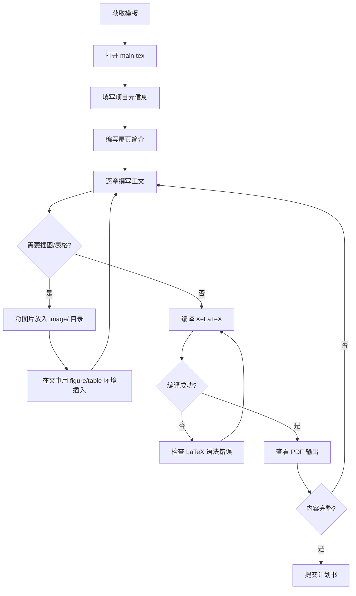
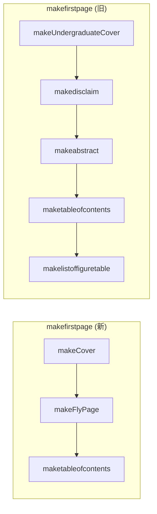

# 温州大学硕士论文模板 → 中国国际大学生创新创业计划书模板 — 二次开发设计文档

> 生成日期：2026-03-26  
> 项目路径：`pdf/`  
> 源模板：温州大学硕士学位论文 LaTeX 模板（`wzuthesis.cls` + `main.tex`）  
> 目标模板：中国国际大学生创新创业计划书  
> 目标结构参考：`template.md`

---

## 1. 项目基线概述

### 1.1 项目架构总览

本项目是一个基于 **XeLaTeX + ctexbook** 的中文学术文档排版系统，核心由两个文件组成：

| 文件 | 角色 | 行数 | 说明 |
|------|------|------|------|
| `wzuthesis.cls` | 文档类定义 | ~800行 | 定义页面布局、字体、封面、摘要、目录、页眉页脚、章节格式等 |
| `main.tex` | 主文档 | ~230行 | 使用文档类，填充论文内容（元信息、摘要、章节、致谢等） |
| `main.bib` | 参考文献 | ~30行 | BibTeX 格式参考文献数据库 |
| `template.md` | 目标参考 | ~200行 | 创新创业计划书结构说明（Markdown 格式） |

### 1.2 字体体系

| 用途 | 字体 | 来源 |
|------|------|------|
| 西文正文 | Times New Roman | 系统字体 |
| 中文正文（宋体） | AdobeSongStd-Light.otf | `fonts/` 目录 |
| 中文黑体 | AdobeHeitiStd-Regular.otf | `fonts/` 目录 |
| 中文楷体 | AdobeKaitiStd-Regular.otf | `fonts/` 目录 |
| 中文仿宋 | AdobeFangsongStd-Regular.otf | `fonts/` 目录 |
| 封面校名 | 华文行楷.ttf | `fonts/` 目录 |
| 等宽字体 | Consolas | 系统字体 |

### 1.3 页面与版式设计

- **纸张**：A4
- **页边距**：上/下/左/右 = 2.5cm
- **字号**：正文小四号（`zihao=-4`），约 12pt
- **行距**：1.2 倍行距（`\baselinestretch{1.2}`）
- **页眉**：五号宋体，居中显示"温州大学硕士学位论文"，下划线分隔
- **页脚**：五号字号页码居中
- **章节编号**：阿拉伯数字（`1`，`1.1`，`1.1.1`）

### 1.4 当前文档结构（main.tex）

```
frontmatter
  ├── 封面（自动生成）
  │   ├── 分类号 / UDC / 学号 / 密级
  │   ├── "温州大学" + "硕士学位论文" 标题
  │   ├── 论文中文题目
  │   ├── 作者姓名 / 培养类型 / 学位类型 / 专业名称 / 研究方向 / 指导教师 / 完成日期
  │   └── "温州大学学位委员会"
  ├── 独创性声明 + 授权声明
  ├── 中文摘要 + 关键词
  ├── 英文摘要 + 关键词
  ├── 目录
  ├── 图目录
  └── 表目录
mainmatter
  ├── 第1章 引言
  ├── 第2章 LaTeX 模板使用说明
  ├── 第3章 参考文献说明
  └── ...（正文章节）
backmatter
  ├── 参考文献列表
  ├── 附录
  ├── 致谢
  └── 攻读硕士学位期间取得的主要学术成果
```

### 1.5 cls 文件核心功能模块

| 模块 | 功能 | 涉及命令/环境 |
|------|------|---------------|
| 元信息定义 | 定义论文元数据的宏 | `\ctitle`, `\etitle`, `\cauthor`, `\fen`, `\udc`, `\id`, `\mi`, `\xwlx`, `\pylx`, `\cmajor`, `\cclass`, `\cmentor`, `\cdata`, `\blindcode` |
| 封面生成 | 正常封面 & 盲审封面 | `\makeUndergraduateCover`, `\makeblindpage` |
| 声明页 | 独创性声明 + 授权声明 | `\makedisclaim` |
| 摘要 | 中英文摘要页 | `\makecabstract`, `\makeeabstract`, `\makeabstract` |
| 目录 | 正文目录 + 图表目录 | `\maketableofcontents`, `\makelistoffiguretable` |
| 前置入口 | 按序调用封面→声明→摘要→目录 | `\makefirstpage` |
| 页眉页脚 | main / nohead 两种样式 | `fancyhdr` 配置 |
| 正文格式 | 章/节/子节字号字体 | `\mainmatter` 中 ctexset 配置 |
| 后记格式 | 附录/致谢等格式 | `\backmatter` 中 ctexset 配置 |
| 参考文献 | GB/T 7714 格式 | `\makereferences`, `gbt7714` 宏包 |
| 附录 | 附录编号格式 | `\appendix` |
| 代码排版 | 代码高亮、代码块 | `minted` 宏包, `\inputcode`, `\code`, `codeblock` 环境 |
| 自动引用 | 图/表/公式中文前缀 | `\autoref` 配置 |

### 1.6 资源文件

| 路径 | 说明 |
|------|------|
| `fonts/` | 8个字体文件（4个 Adobe CJK + 4个 Times New Roman + 华文行楷） |
| `image/` | 示例图片（figure.png, table.png, 作者信息.png, 标题使用.png） |
| `image/chap04/` | 章节示例图片（1.jpg, 2.jpg 等） |
| `title.png` | 温州大学校徽/LOGO（封面使用） |
| `vscode.png` | VS Code 截图（文档说明用） |

---

## 2. 数据底座分析

> 本项目为纯 LaTeX 排版项目，不涉及数据库。此处将 LaTeX 宏定义体系类比为"数据层"进行分析。

### 2.1 "元数据表"结构（宏定义字段）

#### 当前元数据字段（硕士论文）

| 宏命令 | 存储字段 | 类型 | 当前用途 | 在目标中是否需要 |
|--------|----------|------|----------|-----------------|
| `\ctitle{}` | 中文标题 | 文本 | 论文中文题目 | ✅ 改为项目名称 |
| `\etitle{}` | 英文标题 | 文本 | 论文英文题目 | ❌ 删除 |
| `\cauthor{}` | 作者姓名 | 文本 | 学位申请人 | ✅ 改为项目负责人姓名 |
| `\fen{}` | 分类号 | 文本 | 中图分类号 | ❌ 删除 |
| `\udc{}` | UDC号 | 文本 | 通用十进分类号 | ❌ 删除 |
| `\id{}` | 学号 | 文本 | 研究生学号 | ❌ 删除 |
| `\mi{}` | 密级 | 文本 | 论文密级 | ❌ 删除 |
| `\xwlx{}` | 学位类型 | 文本 | 学术型/专业型 | ❌ 删除 |
| `\pylx{}` | 培养类型 | 文本 | 全日制/非全日制 | ❌ 删除 |
| `\cmajor{}` | 专业名称 | 文本 | 学科专业 | ❌ 删除 |
| `\cclass{}` | 研究方向 | 文本 | 研究方向 | ❌ 删除 |
| `\cmentor{}` | 指导教师 | 文本 | 导师姓名 | ❌ 删除 |
| `\cdata{}` | 完成日期 | 文本 | 论文完成日期 | ✅ 保留 |
| `\blindcode{}` | 盲审代码 | 文本 | 盲审匿名码 | ❌ 删除 |
| `\cabstract{}` | 中文摘要 | 长文本 | 500-800字摘要 | ❌ 删除（改为扉页） |
| `\eabstract{}` | 英文摘要 | 长文本 | 英文摘要 | ❌ 删除 |
| `\ckeywords{}` | 中文关键词 | 文本 | 关键词列表 | ❌ 删除 |
| `\ekeywords{}` | 英文关键词 | 文本 | 英文关键词 | ❌ 删除 |

#### 目标元数据字段（创新创业计划书）— 需新增

| 宏命令（建议） | 存储字段 | 类型 | 用途 |
|----------------|----------|------|------|
| `\ctitle{}` | 项目名称 | 文本 | 封面主标题（朗朗上口） |
| `\csubtitle{}` | 副标题 | 文本 | 一句话描述做什么的、做得怎么样 |
| `\cauthor{}` | 负责人姓名 | 文本 | 项目负责人 |
| `\cphone{}` | 联系电话 | 文本 | 负责人联系电话 |
| `\csaidao{}` | 所属赛道 | 文本 | 参赛赛道 |
| `\czubie{}` | 组别 | 文本 | 参赛组别 |
| `\cprovince{}` | 所在省份 | 文本 | 参赛省份 |
| `\cschool{}` | 所在学校 | 文本 | 参赛学校 |
| `\ccompany{}` | 公司名称 | 文本 | 已注册公司名（可选） |
| `\cdata{}` | 完成日期 | 文本 | 计划书完成日期 |

### 2.2 "关联关系"分析

```
main.tex ──uses──> wzuthesis.cls (文档类)
main.tex ──uses──> main.bib (参考文献)
main.tex ──uses──> image/* (图片资源)
main.tex ──uses──> fonts/* (字体文件，通过cls间接引用)
wzuthesis.cls ──uses──> title.png (封面LOGO)
wzuthesis.cls ──depends──> ctexbook (基础文档类)
wzuthesis.cls ──depends──> fancyhdr, geometry, tocloft, natbib, gbt7714... (宏包)
```

### 2.3 "枚举值/状态机"

- **盲审模式**：`\def\blind{}` — 启用后隐藏作者信息、致谢，使用盲审封面 → **目标中不需要**
- **双面打印模式**：`print-both-sides` 选项 → **目标中可保留**

---

## 3. 差异分析矩阵

### 3.1 文档结构层面

| 序号 | 模块 | 当前（硕士论文） | 目标（创新创业计划书） | 状态 | 影响文件 | 工作量 |
|------|------|-----------------|----------------------|------|----------|--------|
| S-01 | 封面 | 学术论文封面（分类号/UDC/学号/密级 + 校名 + "硕士学位论文" + 元信息表） | 创业计划书封面（温大LOGO + 项目名称 + 副标题 + 赛道/组别/省份/学校/姓名/电话/公司名） | 🔴 需全新开发 | `wzuthesis.cls` (封面生成函数) | 高 |
| S-02 | 扉页 | 无（直接进入声明页） | 项目最核心精华内容介绍页 | 🔴 需全新开发 | `wzuthesis.cls` (新增扉页命令), `main.tex` | 中 |
| S-03 | 独创性声明 | 学位论文独创性声明 + 授权声明 | 不需要 | 🟡 需删除 | `wzuthesis.cls` (`\makedisclaim`), `main.tex` | 低 |
| S-04 | 中文摘要 | 500-800字学术摘要 + 关键词 | 不需要 | 🟡 需删除 | `wzuthesis.cls`, `main.tex` | 低 |
| S-05 | 英文摘要 | 英文学术摘要 + 英文关键词 | 不需要 | 🟡 需删除 | `wzuthesis.cls`, `main.tex` | 低 |
| S-06 | 目录 | 二级目录（图目录 + 表目录） | 二级目录（无图表目录） | 🟡 需修改扩展 | `wzuthesis.cls`, `main.tex` | 低 |
| S-07 | 正文第一章 | 引言/绪论 | 一、项目概述（含项目背景/市场机遇/痛点/技术方案/营收/团队/股权融资） | 🔴 需全新开发 | `main.tex` | 中 |
| S-08 | 正文第二章 | 模板使用说明 | 二、行业背景和市场分析（行业发展/销售额/政府影响/市场细分/目标市场/市场定位） | 🔴 需全新开发 | `main.tex` | 中 |
| S-09 | 正文第三章 | 参考文献说明 | 三、产品与服务（技术概况/痛点/产品服务内容/竞品分析/应用案例） | 🔴 需全新开发 | `main.tex` | 中 |
| S-10 | 正文第四章 | （无） | 四、运营模式（生产经营/营销推广） | 🔴 需全新开发 | `main.tex` | 中 |
| S-11 | 正文第五章 | （无） | 五、创业团队（创业团队/创业导师团队） | 🔴 需全新开发 | `main.tex` | 中 |
| S-12 | 正文第六章 | （无） | 六、财务预测与融资计划（财务分析/盈亏平衡） | 🔴 需全新开发 | `main.tex` | 中 |
| S-13 | 正文第七章 | （无） | 七、风险分析 | 🔴 需全新开发 | `main.tex` | 低 |
| S-14 | 正文第八章 | （无） | 八、发展规划与未来愿景 | 🔴 需全新开发 | `main.tex` | 低 |
| S-15 | 正文第九章 | （无） | 九、附件（佐证、支撑材料） | 🔴 需全新开发 | `main.tex` | 低 |
| S-16 | 参考文献 | GB/T 7714 格式参考文献列表 | 不在主体要求中，可选保留 | 🟡 需修改（改为可选） | `main.tex`, `main.bib` | 低 |
| S-17 | 附录 | 学术附录 | 改为"附件"（专利证书/财务数据/合作协议/营业执照等） | 🟡 需修改扩展 | `wzuthesis.cls`, `main.tex` | 低 |
| S-18 | 致谢 | 学术致谢 | 不需要 | 🟡 需删除 | `main.tex` | 低 |
| S-19 | 学术成果 | 攻读学位期间学术成果 | 不需要 | 🟡 需删除 | `main.tex` | 低 |

### 3.2 排版格式层面

| 序号 | 模块 | 当前 | 目标 | 状态 | 影响文件 | 工作量 |
|------|------|------|------|------|----------|--------|
| F-01 | 页眉 | "温州大学硕士学位论文" | 可改为"中国国际大学生创新创业计划书"或项目名称 | 🟡 需修改扩展 | `wzuthesis.cls` (fancypagestyle) | 低 |
| F-02 | 章节编号 | 阿拉伯数字（1, 1.1, 1.1.1） | 中文一级编号："一、二、三..."；二级编号"（一）（二）..."；三级编号"1. 2. 3." | 🔴 需全新开发 | `wzuthesis.cls` (ctexset chapter/section) | 高 |
| F-03 | 页面布局 | A4, 2.5cm 四边 | 保持不变或微调 | 🟢 可直接复用 | `wzuthesis.cls` | 无 |
| F-04 | 字体体系 | 宋体/黑体/楷体 + Times New Roman | 保持不变 | 🟢 可直接复用 | `wzuthesis.cls`, `fonts/` | 无 |
| F-05 | 行距 | 1.2倍行距 | 计划书一般用1.5倍行距更佳 | 🟡 需修改扩展 | `wzuthesis.cls` | 低 |
| F-06 | 表格样式 | 三线表 + 双语标注 | 单语标注（中文即可），样式保留 | 🟡 需修改扩展 | `main.tex` | 低 |
| F-07 | 图片标注 | 双语标注 `\bicaption` | 单语标注 `\caption` | 🟡 需修改扩展 | `main.tex` | 低 |
| F-08 | 总页数 | 学术论文无固定要求 | 约100页左右 | 🟢 无需改动 | — | 无 |

### 3.3 功能特性层面

| 序号 | 模块 | 当前 | 目标 | 状态 | 影响文件 | 工作量 |
|------|------|------|------|------|----------|--------|
| C-01 | 盲审模式 | 支持 `\blind` 开关 | 不需要 | 🟡 需删除 | `wzuthesis.cls`, `main.tex` | 低 |
| C-02 | 双语标注 | `bicaption` + `subcaption` | 不需要双语 | 🟡 需修改 | `main.tex`, `wzuthesis.cls` | 低 |
| C-03 | 参考文献格式 | GB/T 7714 + natbib | 可选保留（计划书中引用不多） | 🟢 可直接复用 | `wzuthesis.cls` | 无 |
| C-04 | 代码排版 | minted 宏包 | 不需要（计划书中几乎无代码） | 🟡 可删除减少依赖 | `wzuthesis.cls` | 低 |
| C-05 | 图表目录 | 独立图目录 + 表目录 | 不需要 | 🟡 需删除 | `wzuthesis.cls`, `main.tex` | 低 |
| C-06 | 交叉引用 | `\autoref` 中文前缀 | 保留 | 🟢 可直接复用 | `wzuthesis.cls` | 无 |
| C-07 | 封面LOGO | title.png（温大校徽） | 需要替换为温大LOGO或大赛统一LOGO | 🟡 需修改 | `title.png`, `wzuthesis.cls` | 低 |

### 3.4 差异统计汇总

| 状态 | 数量 | 占比 |
|------|------|------|
| 🟢 可直接复用 | 5 | 17% |
| 🟡 需修改扩展 | 14 | 48% |
| 🔴 需全新开发 | 10 | 35% |

> **结论**：约 83% 的模块需要修改或重建，但底层排版引擎（字体、页面布局、宏包依赖）可大量复用。改造核心工作集中在：**封面重设计**、**章节编号体系重构**、**正文结构替换**。

---

## 4. 技术方案总述

### 4.1 整体策略

采用**就地改造**策略，在现有 `wzuthesis.cls` 基础上进行修改，重命名为 `cxcyplan.cls`（创新创业计划），保留可复用的排版基础设施，重写不适用的模块。

### 4.2 改造路线图

```
Phase A: cls 文件改造（核心）
  A1. 重命名 cls → cxcyplan.cls
  A2. 重新定义元信息宏
  A3. 重写封面生成函数
  A4. 新增扉页生成函数
  A5. 重构章节编号体系（一、二、三...）
  A6. 修改页眉页脚
  A7. 删除不需要的模块（盲审、声明、摘要等）
  A8. 调整行距为 1.5 倍

Phase B: main.tex 重写
  B1. 更新 documentclass 引用
  B2. 填写新的元信息
  B3. 重写正文九章结构
  B4. 添加模板提示文字（guide text）
  B5. 清理不需要的宏包和设置

Phase C: 资源更新
  C1. 替换/更新封面 LOGO
  C2. 清理示例图片
  C3. 更新 .bib 文件（可选）
```

### 4.3 "后端"方案概述（cls 文件改造）

> 在 LaTeX 项目中，`.cls` 文件扮演"后端"角色——它定义数据结构（宏）、业务逻辑（排版规则）、输出渲染（页面格式）。

#### A2. 元信息宏重新定义

**删除的宏**（共 12 个）：
```latex
\etitle, \fen, \udc, \id, \mi, \xwlx, \pylx, \cmajor, \cclass, \cmentor, \blindcode
\cabstract, \eabstract, \ckeywords, \ekeywords
```

**保留并修改的宏**（共 2 个）：
```latex
\ctitle{}     % 语义改为"项目名称"
\cauthor{}    % 语义改为"项目负责人"
\cdata{}      % 语义改为"完成日期"
```

**新增的宏**（共 7 个）：
```latex
\csubtitle{}   % 副标题
\cphone{}      % 联系电话
\csaidao{}     % 所属赛道
\czubie{}      % 组别
\cprovince{}   % 所在省份
\cschool{}     % 所在学校
\ccompany{}    % 公司名称（可选）
```

#### A3. 封面生成函数重写

新封面设计规格：
```
┌─────────────────────────────────┐
│         温州大学 LOGO            │  ← title.png（居中）
│                                  │
│   项目名称（大号黑体居中）        │  ← \ctitle
│   副标题（中号宋体居中）          │  ← \csubtitle
│                                  │
│   所属赛道：XXXX    组别：XXXX   │  ← \csaidao, \czubie
│   所在省份：XXXX                 │  ← \cprovince
│   所在学校：XXXX                 │  ← \cschool
│   姓    名：XXXX                 │  ← \cauthor
│   联系电话：XXXX                 │  ← \cphone
│   公司名称：XXXX（如已注册）     │  ← \ccompany
│                                  │
│          完成日期                 │  ← \cdata
└─────────────────────────────────┘
```

封面函数伪代码：
```latex
\newcommand\makeCover{
    \begin{titlepage}
        \thispagestyle{empty}
        \begin{center}
            % LOGO
            \includegraphics[width=0.3\textwidth]{title.png}
            \vspace{1cm}
            
            % 项目名称
            {\heiti \zihao{1} \bfseries \@ctitle}
            \vspace{0.5cm}
            
            % 副标题
            {\songti \zihao{3} \@csubtitle}
            \vspace{2cm}
            
            % 信息表
            \begin{tabular}{rl}
                所属赛道： & \@csaidao \\
                组    别： & \@czubie \\
                所在省份： & \@cprovince \\
                所在学校： & \@cschool \\
                姓    名： & \@cauthor \\
                联系电话： & \@cphone \\
                公司名称： & \@ccompany \\
            \end{tabular}
            
            \vfill
            {\songti \zihao{4} \@cdata}
        \end{center}
    \end{titlepage}
}
```

#### A4. 扉页生成函数（新增）

```latex
\newcommand\cflypage[1]{\def\@cflypage{#1}}  % 定义扉页内容宏

\newcommand\makeFlyPage{
    \newpage
    \thispagestyle{empty}
    \vspace*{3cm}
    \begin{center}
        {\heiti \zihao{3} \bfseries 项目简介}
    \end{center}
    \vspace{1cm}
    {\songti \zihao{4} \linespread{1.8}\selectfont
        \@cflypage
    }
    \newpage
}
```

#### A5. 章节编号体系重构

核心改动：将 `chapter` 用中文数字编号，`section` 用带括号的中文数字，`subsection` 用阿拉伯数字加点。

```latex
\renewcommand\mainmatter{
    \@mainmattertrue
    \pagenumbering{arabic}
    \ctexset{
        chapter = {
            format = {\centering\zihao{3}\heiti\bfseries},
            number = {\chinese{chapter}},
            name = {,、},
            aftername = {},
            beforeskip = {10pt},
            afterskip = {20pt},
        },
        section = {
            format = {\zihao{4}\heiti},
            name = {（,）},
            number = {\chinese{section}},
            aftername = {},
        },
        subsection = {
            format = {\zihao{4}\heiti},
            number = {\arabic{subsection}},
            aftername = {. },
        },
    }
    \zihao{-4}\songti \linespread{1.5}\selectfont
    \mainpagestyle
}
```

#### A6. 页眉页脚修改

```latex
\fancypagestyle{main}{
    \fancyhf{}
    \fancyhead[c]{\zihao{5}\songti 中国国际大学生创新创业计划书}
    \fancyfoot[C]{\zihao{5}\thepage}
    \renewcommand{\headrulewidth}{1pt}
    \renewcommand{\footrulewidth}{0pt}
}
```

#### A7. 删除不需要的模块

需要从 `wzuthesis.cls` 中移除或注释的函数/命令：
- `\makedisclaim` — 独创性声明（整个函数体）
- `\makecabstract` — 中文摘要生成
- `\makeeabstract` — 英文摘要生成
- `\makeabstract` — 摘要入口
- `\makeblindpage` — 盲审封面
- 盲审相关的条件判断 `\ifdefined\blind`
- `bicaption` 相关配置

#### A8. 行距调整

```latex
% 从 1.2 改为 1.5
\renewcommand{\baselinestretch}{1.5}
```

### 4.4 "前端"方案概述（main.tex 重写）

> 在 LaTeX 项目中，`main.tex` 扮演"前端"角色——负责内容组织、用户交互（模板填充引导）、可视化呈现。

#### B1-B2. 文档头部

```latex
\documentclass{cxcyplan}

%%===============项目信息========================
\ctitle{项目名称（朗朗上口）}
\csubtitle{一句话描述做什么的，做得怎么样}
\cauthor{张三}
\cphone{138XXXXXXXX}
\csaidao{高教主赛道}
\czubie{创意组}
\cprovince{浙江省}
\cschool{温州大学}
\ccompany{XXX科技有限公司}
\cdata{2026年3月}
%%===============================================

%% 扉页内容
\cflypage{
  本项目聚焦于...（项目最核心、最精华内容介绍，务必突出项目最大的优势）
}
```

#### B3. 正文九章结构

```latex
\begin{document}
\frontmatter
\makefirstpage  % 封面 + 扉页 + 目录

\mainmatter
\chapter{项目概述}
\section{项目背景}
\section{市场机遇与发展前景}
\section{项目痛点}
\section{产品技术解决方案、竞争优势}
\section{项目营收与社会影响}
\section{项目核心团队}
\section{项目股权与融资}

\chapter{行业背景和市场分析}
\section{该行业发展程度如何？现在发展动态如何？}
\section{该行业的总销售额有多少？总收入是多少？发展趋势怎样？}
\section{经济发展对该行业的影响程度如何？政府是如何影响该行业的？}
\section{市场细分}
\section{目标市场}
\section{市场定位}

\chapter{产品与服务}
\section{技术概况介绍}
\section{该领域存在的难点、痛点问题}
\section{产品或服务内容}
\section{竞品分析}
\section{应用案例}

\chapter{运营模式}
\section{生产经营}
\section{营销推广}

\chapter{创业团队}
\section{创业团队}
\section{创业导师团队}

\chapter{财务预测与融资计划}
\section{财务分析}
\section{完成研发所需投入与盈亏平衡}

\chapter{风险分析}
（企业面临的风险及对策）

\chapter{发展规划与未来愿景}
（三个维度 + 未来愿景）

\chapter{附件}
\section{书面授权许可书、专利证书}
\section{财务数据、已获投资情况}
\section{政府机构合作协议}
\section{已完成工商登记注册的相关材料}

\end{document}
```

### 4.5 数据变更方案

| 变更类型 | 对象 | 说明 |
|----------|------|------|
| 重命名 | `wzuthesis.cls` → `cxcyplan.cls` | 文档类文件重命名 |
| 重写 | `main.tex` | 全新正文结构 |
| 替换 | `title.png` | 更新为适合计划书的 LOGO |
| 清理 | `image/` 目录下示例图片 | 移除学术论文示例图 |
| 可选删除 | `main.bib`, `main.bbl` | 计划书不要求参考文献（但可保留） |
| 删除 | `main.aux`, `main.lof`, `main.lot`, `main.toc`, `main.log`, `main.out`, `main.synctex.gz` | 编译产物，重新编译即可生成 |

---

## 5. 接口设计

> 在 LaTeX 项目中，"接口"对应用户在 `main.tex` 中可调用的宏命令和环境。以下列出新增/修改/删除的"API"。

### 5.1 新增接口

| 接口（宏命令） | 参数 | 说明 | 使用示例 |
|----------------|------|------|----------|
| `\csubtitle{}` | 文本 | 设置项目副标题 | `\csubtitle{全球首创XX技术}` |
| `\cphone{}` | 文本 | 设置联系电话 | `\cphone{13800138000}` |
| `\csaidao{}` | 文本 | 设置所属赛道 | `\csaidao{高教主赛道}` |
| `\czubie{}` | 文本 | 设置组别 | `\czubie{创意组}` |
| `\cprovince{}` | 文本 | 设置所在省份 | `\cprovince{浙江省}` |
| `\cschool{}` | 文本 | 设置所在学校 | `\cschool{温州大学}` |
| `\ccompany{}` | 文本 | 设置公司名称 | `\ccompany{XX科技有限公司}` |
| `\cflypage{}` | 长文本 | 设置扉页内容 | `\cflypage{本项目聚焦于...}` |
| `\makeCover` | — | 生成封面页 | 在 `\makefirstpage` 中自动调用 |
| `\makeFlyPage` | — | 生成扉页 | 在 `\makefirstpage` 中自动调用 |

### 5.2 修改接口

| 接口 | 原始用途 | 新用途 | 变更说明 |
|------|----------|--------|----------|
| `\ctitle{}` | 论文中文标题 | 项目名称 | 语义变更，无需改代码 |
| `\cauthor{}` | 论文作者 | 项目负责人 | 语义变更，无需改代码 |
| `\cdata{}` | 论文完成日期 | 计划书完成日期 | 语义变更，无需改代码 |
| `\makefirstpage` | 封面→声明→摘要→目录→图表目录 | 封面→扉页→目录 | 重写调用链 |

### 5.3 删除接口

| 接口 | 原用途 | 删除原因 |
|------|--------|----------|
| `\etitle{}` | 英文标题 | 计划书无需英文 |
| `\fen{}` | 分类号 | 非学术文档 |
| `\udc{}` | UDC号 | 非学术文档 |
| `\id{}` | 学号 | 非学术文档 |
| `\mi{}` | 密级 | 非学术文档 |
| `\xwlx{}` | 学位类型 | 非学术文档 |
| `\pylx{}` | 培养类型 | 非学术文档 |
| `\cmajor{}` | 专业名称 | 非学术文档 |
| `\cclass{}` | 研究方向 | 非学术文档 |
| `\cmentor{}` | 指导教师 | 非学术文档 |
| `\blindcode{}` | 盲审代码 | 非学术文档 |
| `\cabstract{}` | 中文摘要 | 无摘要需求 |
| `\eabstract{}` | 英文摘要 | 无摘要需求 |
| `\ckeywords{}` | 中文关键词 | 无关键词需求 |
| `\ekeywords{}` | 英文关键词 | 无关键词需求 |
| `\makedisclaim` | 声明页 | 无声明需求 |
| `\makeabstract` | 摘要页 | 无摘要需求 |
| `\makeblindpage` | 盲审封面 | 无盲审需求 |
| `\makelistoffiguretable` | 图表目录 | 无图表目录需求 |
| `\overcite{}` | 上标引用 | 计划书很少引用（可选保留） |

---

## 6. 数据模型变更

> 在 LaTeX 项目中，"数据模型"对应 `.cls` 文件中的宏定义、命令签名和排版参数。以下用"DDL"类比的方式记录变更。

### 6.1 新增"字段"（宏定义）

```latex
% ====== 创新创业计划书元信息定义 ======
\newcommand\csubtitle[1]{\def\@csubtitle{#1}}    % 项目副标题
\newcommand\cphone[1]{\def\@cphone{#1}}           % 联系电话
\newcommand\csaidao[1]{\def\@csaidao{#1}}         % 所属赛道
\newcommand\czubie[1]{\def\@czubie{#1}}           % 组别
\newcommand\cprovince[1]{\def\@cprovince{#1}}     % 所在省份
\newcommand\cschool[1]{\def\@cschool{#1}}         % 所在学校 （注：原cls中已有此宏但未使用）
\newcommand\ccompany[1]{\def\@ccompany{#1}}       % 公司名称
\newcommand\cflypage[1]{\def\@cflypage{#1}}       % 扉页内容
```

### 6.2 删除"字段"

```latex
% 以下宏定义将从 cls 中移除
% \newcommand\etitle[1]{\def\@etitle{#1}}
% \newcommand\fen[1]{\def\@fen{#1}}
% \newcommand\udc[1]{\def\@udc{#1}}
% \newcommand\id[1]{\def\@id{#1}}
% \newcommand\mi[1]{\def\@mi{#1}}
% \newcommand\pylx[1]{\def\@pylx{#1}}
% \newcommand\xwlx[1]{\def\@xwlx{#1}}
% \newcommand\cmajor[1]{\def\@cmajor{#1}}
% \newcommand\cclass[1]{\def\@cclass{#1}}
% \newcommand\cmentor[1]{\def\@cmentor{#1}}
% \newcommand\blindcode[1]{\def\@blindcode{#1}}
% \newcommand\cabstract[1]{\def\@cabstract{#1}}
% \newcommand\eabstract[1]{\def\@eabstract{#1}}
% \newcommand\ckeywords[1]{\def\@ckeywords{#1}}
% \newcommand\ekeywords[1]{\def\@ekeywords{#1}}
```

### 6.3 修改"表结构"（排版参数）

| 参数 | 当前值 | 目标值 | 位置 |
|------|--------|--------|------|
| `\baselinestretch` | 1.2 | 1.5 | cls 全局 |
| chapter format number | `\arabic{chapter}` | `\chinese{chapter}` | `\mainmatter` ctexset |
| chapter name | `{}` | `{,、}` | `\mainmatter` ctexset |
| section name | `{}` | `{（,）}` | `\mainmatter` ctexset |
| section number | `\thesection` | `\chinese{section}` | `\mainmatter` ctexset |
| header text | "温州大学硕士学位论文" | "中国国际大学生创新创业计划书" | fancypagestyle main |

---

## 7. 前端交互设计

### 7.1 页面结构总览

```
┌─────────────────────────────┐
│          封面（1页）          │  ← \makeCover 自动生成
├─────────────────────────────┤
│          扉页（1页）          │  ← \makeFlyPage 自动生成
├─────────────────────────────┤
│         目录（1-2页）         │  ← \maketableofcontents 自动生成
├─────────────────────────────┤
│     一、项目概述（~10页）     │
│     二、行业背景（~15页）     │
│     三、产品与服务（~20页）   │
│     四、运营模式（~15页）     │
│     五、创业团队（~8页）      │
│     六、财务预测（~10页）     │
│     七、风险分析（~5页）      │
│     八、发展规划（~5页）      │
│     九、附件（~10页）         │
├─────────────────────────────┤
│      （可选）参考文献         │
└─────────────────────────────┘
```

### 7.2 用户填写流程

1. **打开** `main.tex`
2. **填写项目元信息**（封面区域的宏命令）
3. **编写扉页** (`\cflypage{...}`)
4. **逐章填写正文**（每章已预设 `\chapter` 和 `\section` 骨架）
5. **添加图片/表格**（与原模板操作一致，使用 `\includegraphics`、`table` 环境等）
6. **编译**（XeLaTeX → BibTeX → XeLaTeX × 2）
7. **生成 PDF**

### 7.3 组件复用映射

| 原模板组件 | 新模板中用途 | 变更 |
|-----------|-------------|------|
| `\chapter{}` | 九大章节容器 | 编号改为中文 |
| `\section{}` | 子章节容器 | 编号改为 `（一）（二）` |
| `\subsection{}` | 子子章节容器 | 编号改为 `1. 2. 3.` |
| `figure` 环境 | 插入图片 | 去除双语标注 |
| `table` 环境 | 插入表格 | 去除双语标注 |
| `\includegraphics` | 图片引用 | 无变化 |
| `\autoref{}` | 交叉引用 | 无变化 |
| `enumerate` 环境 | 有序列表 | 无变化 |
| `itemize` 环境 | 无序列表 | 无变化 |

---

## 8. 流程图

### 8.1 模板改造工作流程



### 8.2 用户使用流程



### 8.3 封面生成流程



---

## 9. 风险评估

### 9.1 技术风险

| 风险项 | 等级 | 说明 | 应对策略 |
|--------|------|------|----------|
| 章节编号中文化兼容性 | 🟡 中 | `ctexset` 中 `\chinese{}` 计数器在嵌套环境中可能出现编号异常 | 充分测试多级嵌套场景；必要时手动定义计数器格式 |
| 封面排版精度 | 🟡 中 | 纯 LaTeX 实现复杂封面排版较困难，间距需反复调试 | 使用 `textpos` 宏包（cls 已加载）进行绝对定位；预留调试时间 |
| 字体缺失 | 🟢 低 | 华文行楷在部分系统上可能不可用 | 已在 `fonts/` 目录提供字体文件，使用 `Path` 参数指定本地路径 |
| XeLaTeX 编译兼容 | 🟢 低 | 依赖 XeLaTeX 编译器，pdfLaTeX 不兼容 | 在文档中明确标注编译器要求 |

### 9.2 兼容性风险

| 风险项 | 等级 | 说明 | 应对策略 |
|--------|------|------|----------|
| 宏包冲突 | 🟢 低 | 删除的模块（minted 等）可能有残余依赖 | 逐步删除并验证编译 |
| 目录格式 | 🟡 中 | 章节编号改为中文后，目录中的格式需要同步调整 | 同步修改 `tocloft` 相关配置 |
| 交叉引用前缀 | 🟢 低 | `\autoref` 中的 `\chapterautorefname` 等需适配 | 保持中文前缀配置不变或微调 |

### 9.3 数据迁移风险

| 风险项 | 等级 | 说明 | 应对策略 |
|--------|------|------|----------|
| 已有内容丢失 | 🟢 低 | 原 main.tex 中的示例内容在重写过程中被覆盖 | 重写前保留原始文件备份 |
| 图片资源混乱 | 🟢 低 | image/ 目录中的学术论文示例图与新模板无关 | 保留目录结构，清理示例文件，添加 placeholder |

### 9.4 项目管理风险

| 风险项 | 等级 | 说明 | 应对策略 |
|--------|------|------|----------|
| 需求理解偏差 | 🟡 中 | template.md 中的结构描述为建议性文字，具体排版规范未完全明确 | 以 template.md 为主要参考，排版细节参考大赛往年优秀计划书 |
| 排版微调周期长 | 🟡 中 | LaTeX 排版细节调整需要反复编译预览 | 按模块分步实施，每步编译验证 |

### 9.5 风险汇总矩阵

```
        低影响    中影响    高影响
高概率              F-02
中概率   9.3     9.1/9.2
低概率   9.4       9.1
```

> **总体风险评估**：项目改造风险整体可控。最大风险来自章节编号体系重构（F-02），需重点测试。建议按 Phase A → B → C 顺序分步实施，每步编译验证。

---

## 附录：文件变更清单

| 文件 | 操作 | 说明 |
|------|------|------|
| `wzuthesis.cls` | 复制并重命名 → `cxcyplan.cls` | 在副本上进行改造，保留原始文件 |
| `cxcyplan.cls` | 大幅修改 | 新元信息宏、新封面、新扉页、新编号体系、新页眉、删除旧模块 |
| `main.tex` | 完全重写 | 新的九章正文结构 + 元信息 + 扉页 |
| `title.png` | 替换 | 更新封面 LOGO |
| `image/` | 清理 | 移除学术示例图片 |
| `main.bib` | 可选保留 | 按需使用参考文献 |
| `template.md` | 保留 | 作为参考文档 |
| `fonts/` | 保留 | 字体文件完整保留 |
